# 📊 Diagramas UML — Synple

> Diagramas arquiteturais e comportamentais do **Synple**, aplicativo mobile open source para gerenciamento de reuniões, agendamentos e chat integrado.

---

## Índice

1. [Diagrama de Casos de Uso](#1-diagrama-de-casos-de-uso)
2. [Diagrama de Implantação](#2-diagrama-de-implantação)
3. [Diagrama de Classes](#3-diagrama-de-classes)
4. [Diagramas de Sequência](#4-diagramas-de-sequência)
5. [Diagramas de Atividades](#5-diagramas-de-atividades)

---

# 1. Diagrama de Casos de Uso

O diagrama representa as principais funcionalidades disponíveis para o usuário e os serviços responsáveis pelo funcionamento do sistema.

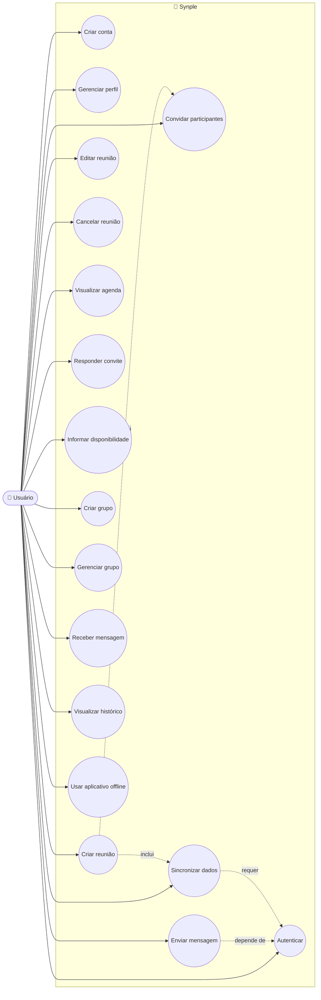

### Principais casos de uso

| ID   | Caso de uso                 | Ator    |
| ---- | --------------------------- | ------- |
| UC01 | Criar conta                 | Usuário |
| UC02 | Autenticar                  | Usuário |
| UC03 | Gerenciar perfil            | Usuário |
| UC04 | Criar reunião               | Usuário |
| UC05 | Editar reunião              | Usuário |
| UC06 | Cancelar reunião            | Usuário |
| UC07 | Visualizar agenda           | Usuário |
| UC08 | Convidar participantes      | Usuário |
| UC09 | Responder convite           | Usuário |
| UC10 | Informar disponibilidade    | Usuário |
| UC11 | Criar grupo                 | Usuário |
| UC12 | Gerenciar grupo             | Usuário |
| UC13 | Enviar mensagem             | Usuário |
| UC14 | Receber mensagem            | Usuário |
| UC15 | Visualizar histórico        | Usuário |
| UC16 | Sincronizar dados           | Sistema |
| UC17 | Utilizar aplicativo offline | Usuário |

---

# 2. Diagrama de Implantação

O Synple possui uma arquitetura cliente-servidor. O aplicativo mobile mantém os dados localmente e se comunica com o servidor quando há conectividade.

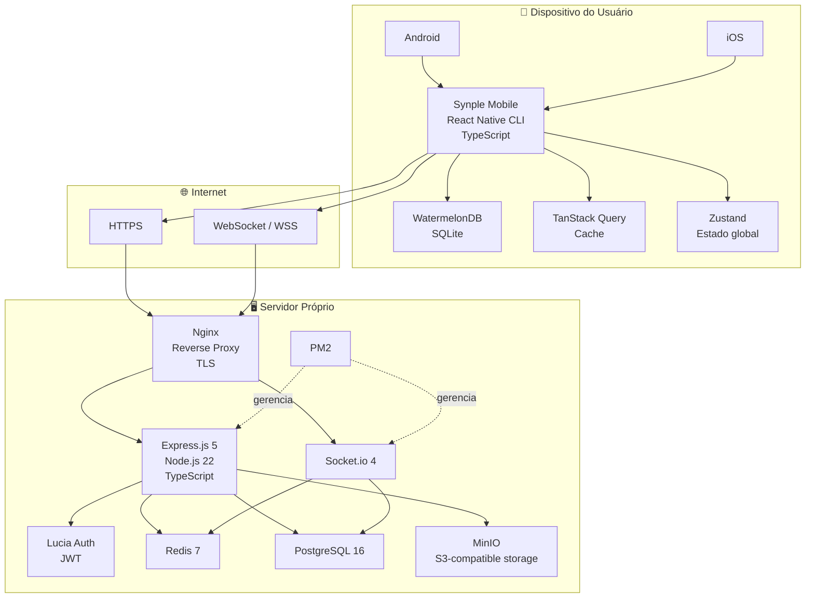

### Implantação física

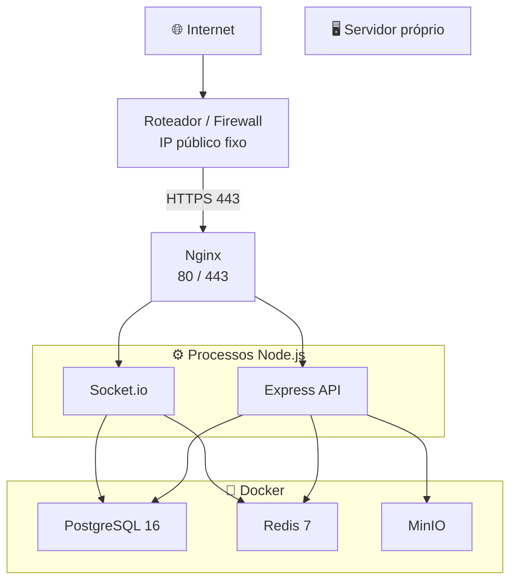

> O diagrama não fixa um endereço IP ou domínio específico. Esses valores pertencem ao ambiente de implantação e devem ser configurados externamente.

---

# 3. Diagrama de Classes

O modelo abaixo representa as principais entidades de domínio do Synple.

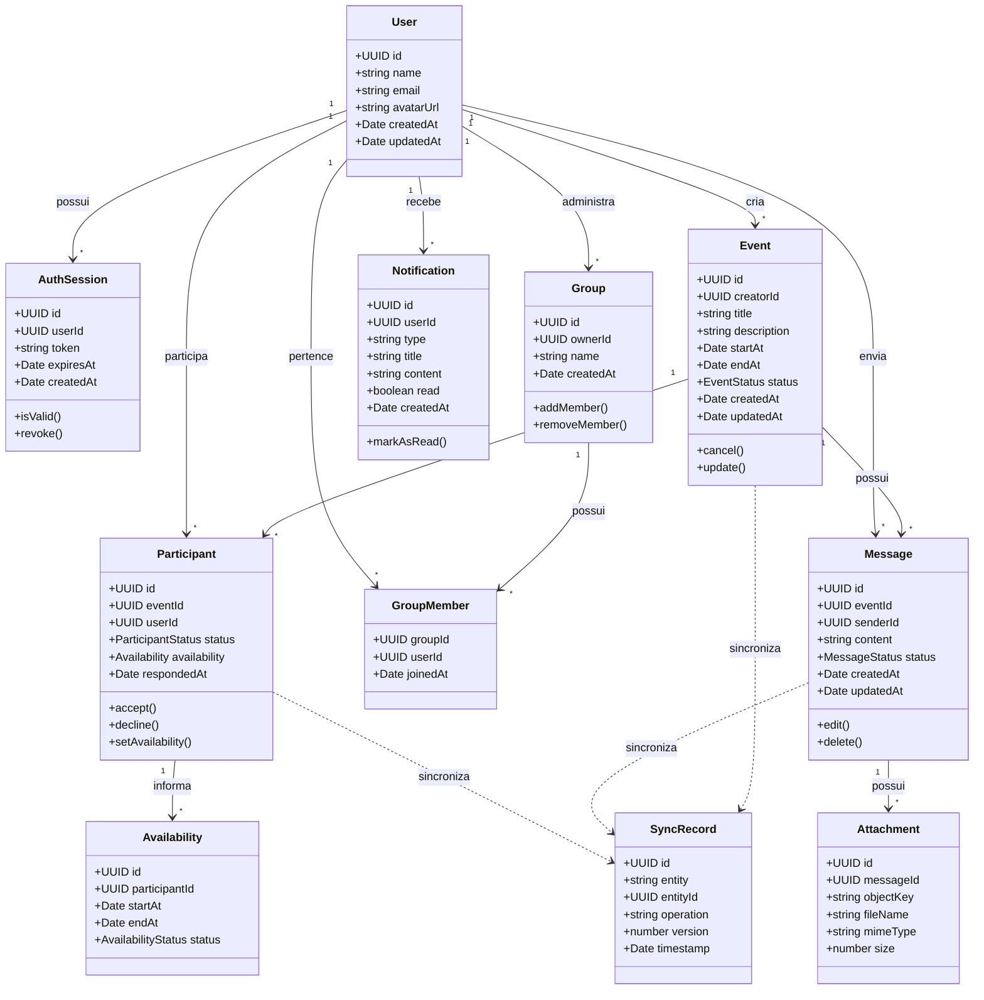

### Relações principais

```text
User
 ├── Event
 │    ├── Participant
 │    │    └── Availability
 │    └── Message
 │         └── Attachment
 │
 ├── Group
 │    └── GroupMember
 │
 ├── AuthSession
 │
 └── Notification
```

---

# 4. Diagramas de Sequência

## 4.1 Criar reunião

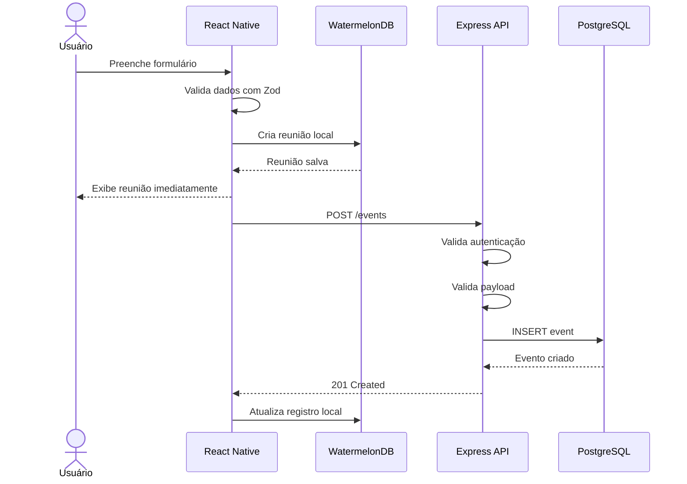

### Com ausência de conexão

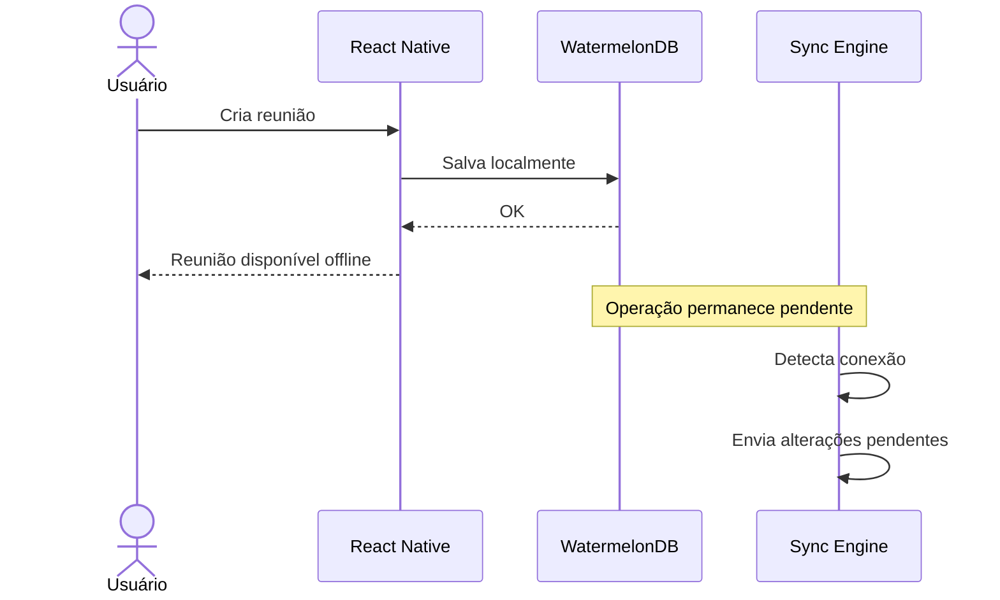

---

## 4.2 Responder convite

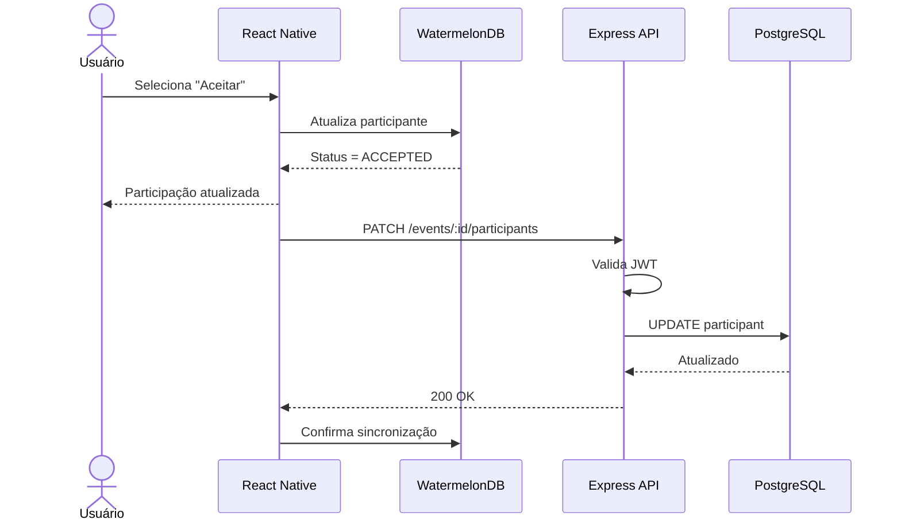

---

## 4.3 Chat em tempo real

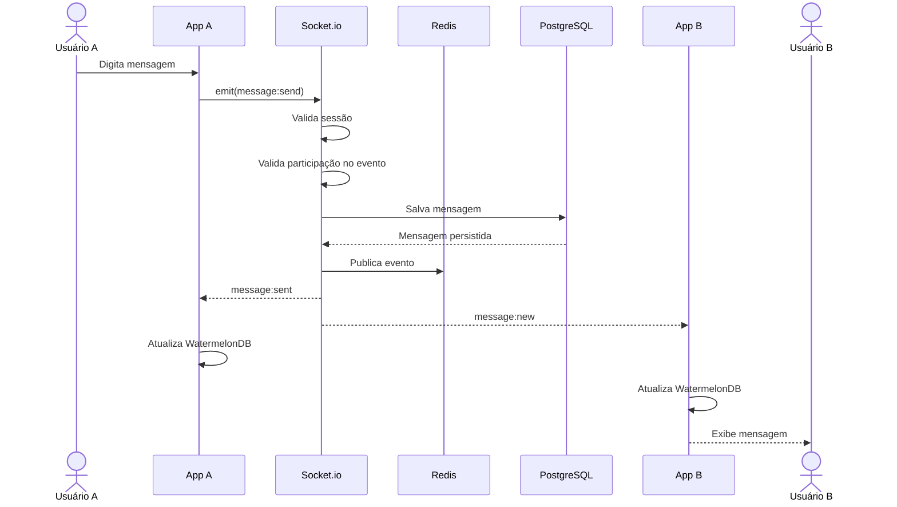

---

## 4.4 Sincronização offline-first

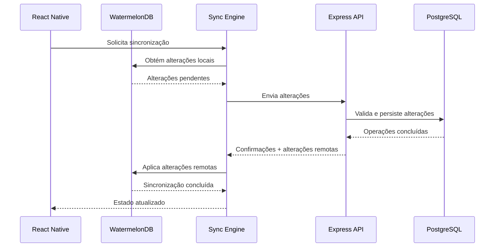

---

# 5. Diagramas de Atividades

## 5.1 Criação de reunião

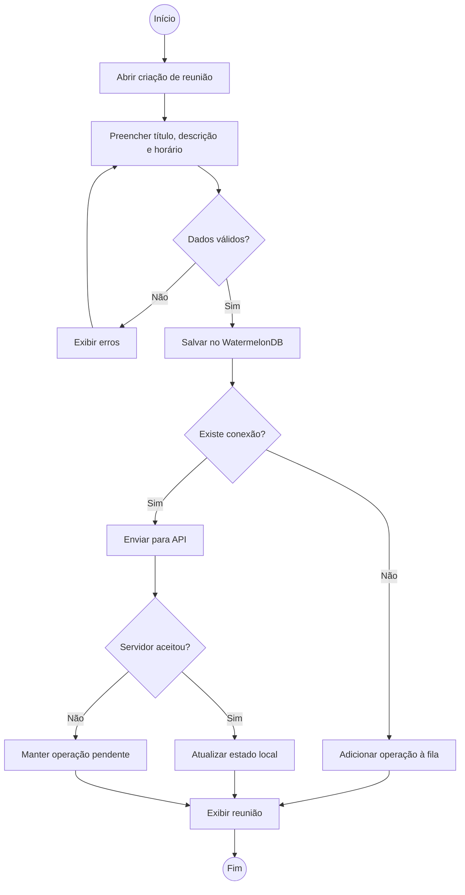

---

## 5.2 Confirmação de disponibilidade

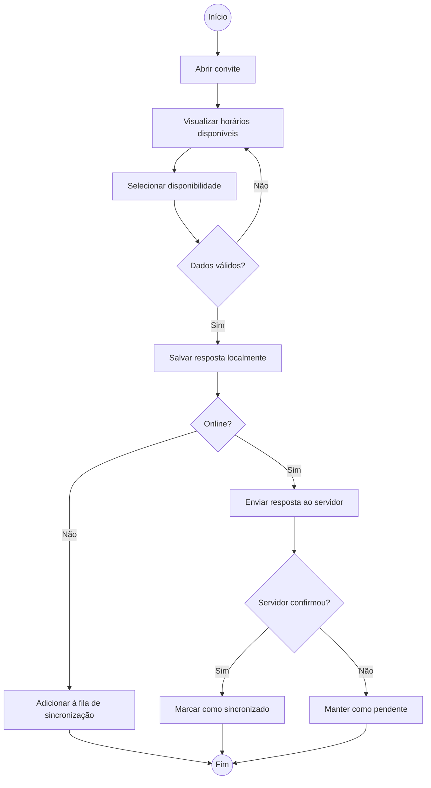

---

## 5.3 Envio de mensagem

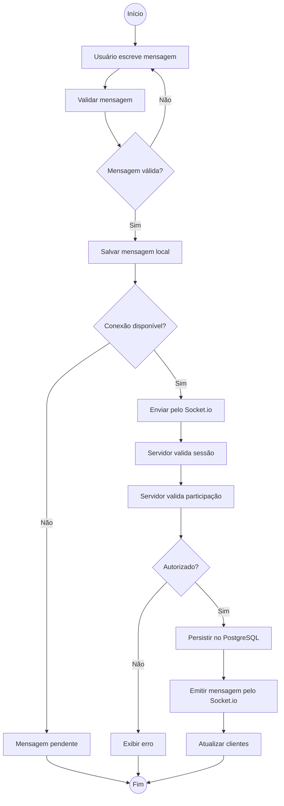

---

## 5.4 Sincronização

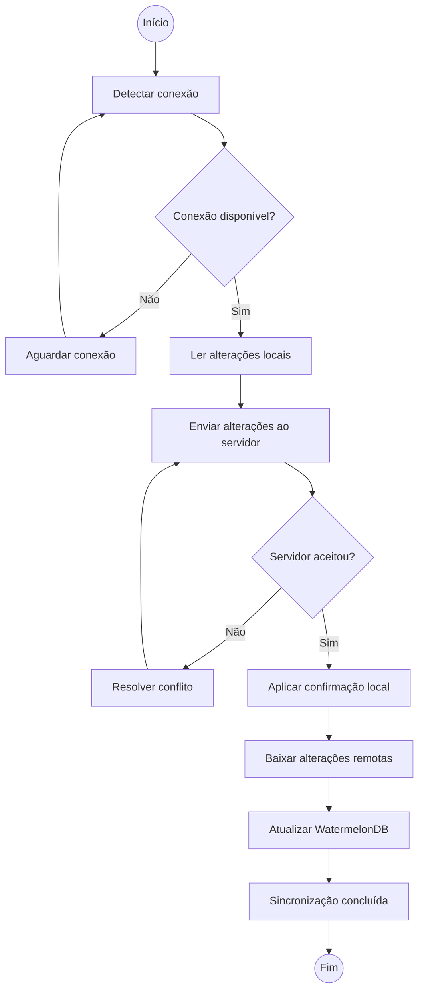

---

# 📁 Organização recomendada

```text
synple/
│
├── mobile/
│   ├── android/
│   ├── ios/
│   ├── src/
│   │   ├── components/
│   │   ├── screens/
│   │   ├── navigation/
│   │   ├── db/
│   │   │   ├── models/
│   │   │   ├── schema.ts
│   │   │   └── sync/
│   │   ├── services/
│   │   │   ├── api.ts
│   │   │   └── socket.ts
│   │   ├── stores/
│   │   ├── hooks/
│   │   ├── types/
│   │   └── utils/
│   └── App.tsx
│
├── server/
│   ├── src/
│   │   ├── routes/
│   │   ├── controllers/
│   │   ├── services/
│   │   ├── repositories/
│   │   ├── socket/
│   │   ├── middleware/
│   │   ├── db/
│   │   └── types/
│   ├── drizzle/
│   └── package.json
│
├── infrastructure/
│   ├── docker-compose.yml
│   ├── nginx/
│   └── pm2/
│
├── docs/
│   └── diagramas/
│       ├── README.md
│       ├── casos-de-uso.md
│       ├── implantacao.md
│       ├── classes.md
│       ├── sequencia/
│       │   ├── criar-reuniao.md
│       │   ├── responder-convite.md
│       │   ├── chat.md
│       │   └── sincronizacao.md
│       └── atividades/
│           ├── criar-reuniao.md
│           ├── disponibilidade.md
│           ├── chat.md
│           └── sincronizacao.md
│
└── README.md
```

---

# 🔗 Relação entre os diagramas

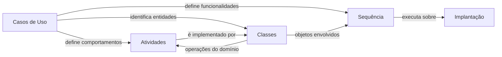

Essa relação é importante porque os diagramas deixam de ser apenas desenhos isolados: **casos de uso → classes → atividades/sequências → implantação** representam diferentes perspectivas do mesmo sistema.
