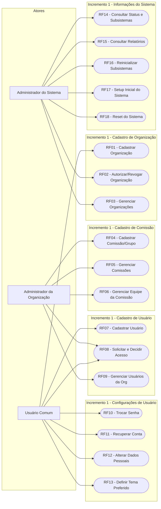
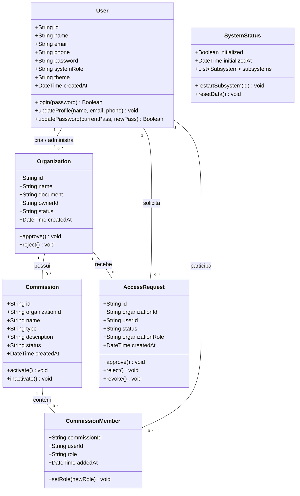
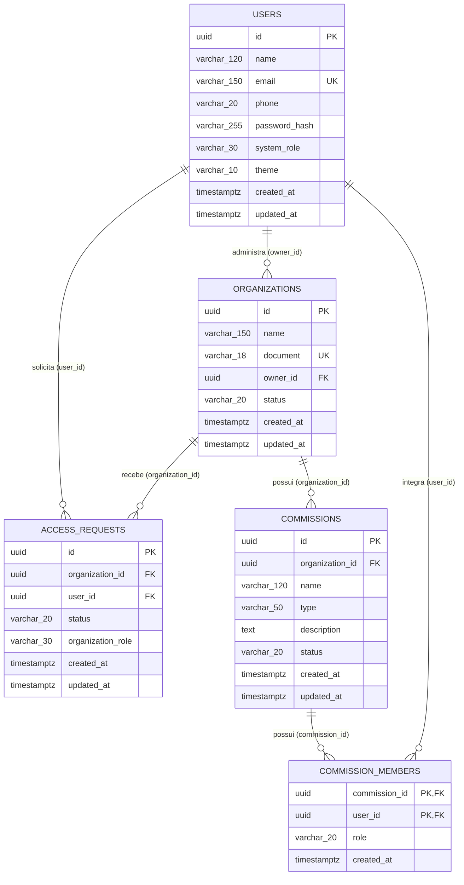
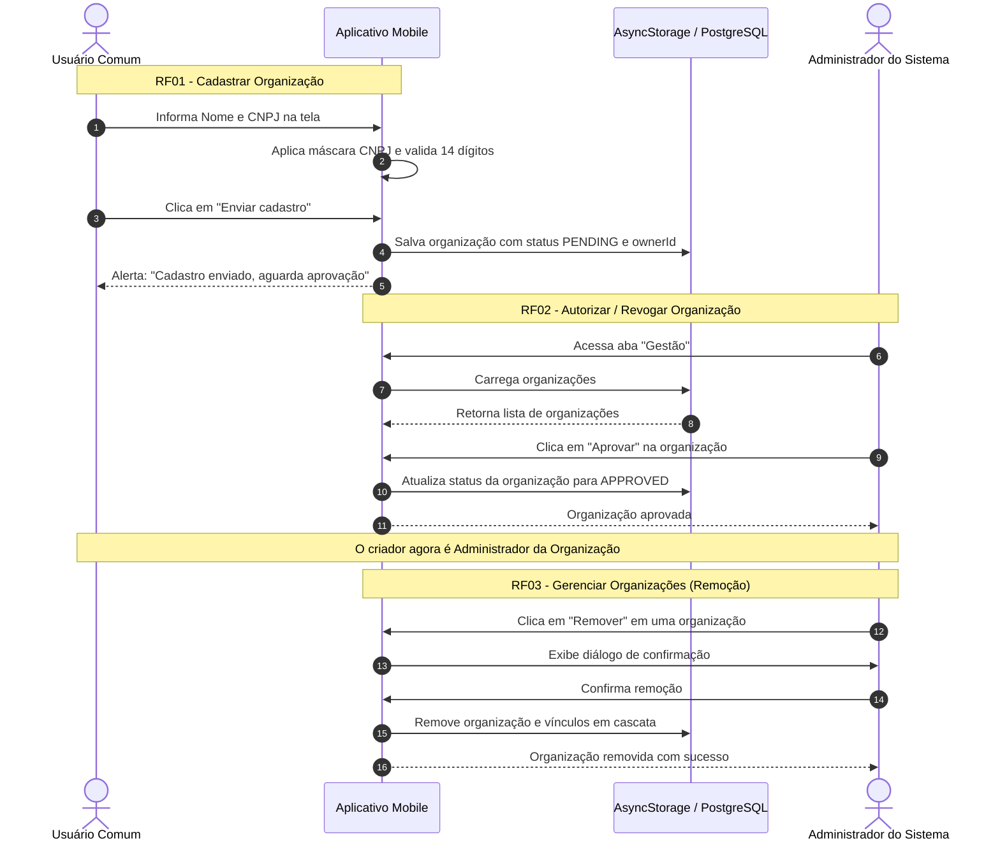
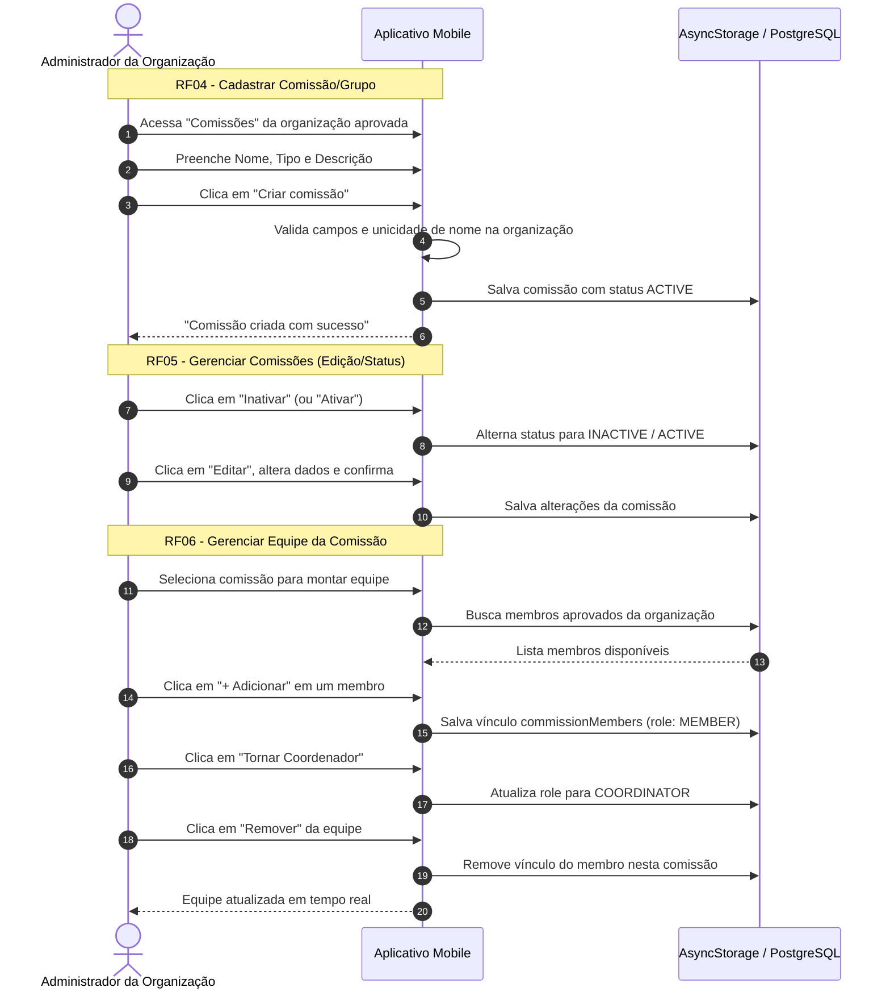
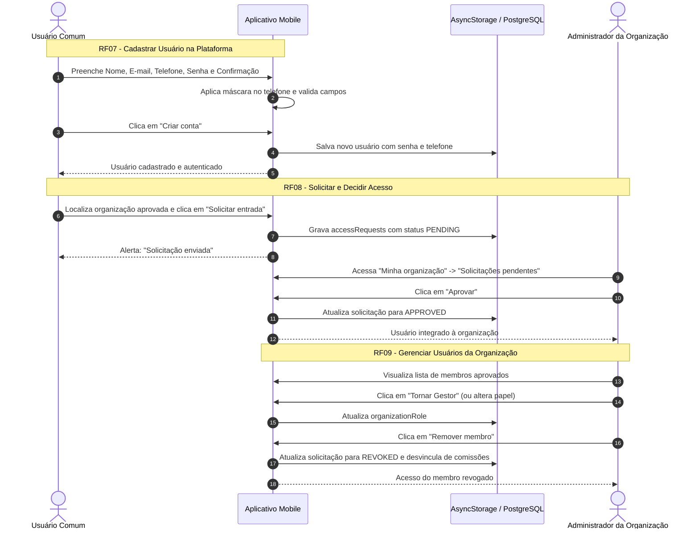
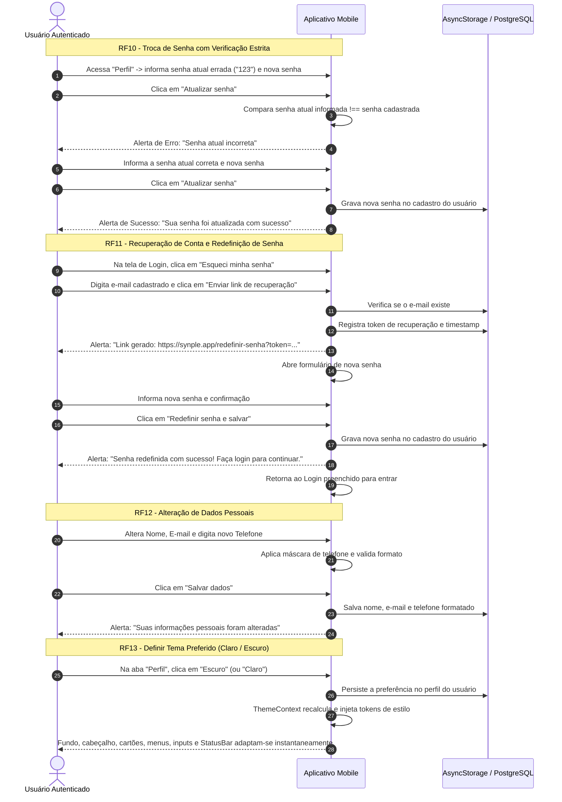
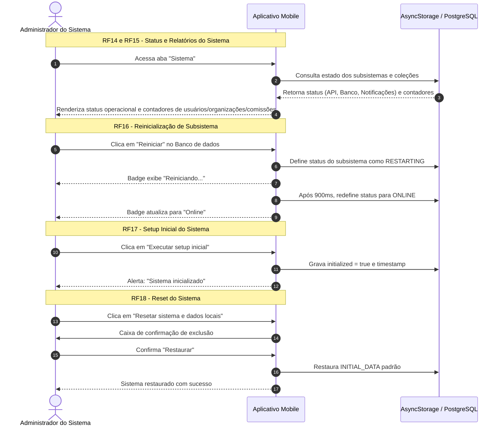

# Especificação de Engenharia de Software — Incremento 1 (Synple)

Documento formal da disciplina **Projeto e Desenvolvimento de Sistemas II (IFSP Câmpus Barretos)** contendo a especificação completa e detalhada do **Incremento 1**.

---

## Sumário de Mapeamento dos Requisitos

| Módulo | ID Requisito | Descrição do Requisito | Ator Principal |
| :--- | :--- | :--- | :--- |
| Cadastro de organização | **RF01** | Cadastrar nova organização com CNPJ | Usuário Comum |
| Cadastro de organização | **RF02** | Autorizar/revogar cadastro da organização | Administrador do Sistema |
| Cadastro de organização | **RF03** | Gerenciar organizações (listagem e remoção) | Administrador do Sistema |
| Cadastro de comissão | **RF04** | Cadastrar comissão/grupo de trabalho na organização | Administrador da Organização |
| Cadastro de comissão | **RF05** | Gerenciar comissões (editar, ativar/inativar, excluir) | Administrador da Organização |
| Cadastro de comissão | **RF06** | Gerenciar equipe da comissão (adicionar, alternar papel, remover) | Administrador da Organização |
| Cadastro de usuário | **RF07** | Cadastrar usuário na plataforma (autocadastro) | Usuário Comum |
| Cadastro de usuário | **RF08** | Solicitar e decidir acesso à organização (aprovar/rejeitar) | Usuário Comum / Admin Org |
| Cadastro de usuário | **RF09** | Gerenciar usuários dentro da organização (papel e revogação) | Administrador da Organização |
| Configurações de usuário | **RF10** | Trocar senha de usuário | Usuário Autenticado |
| Configurações de usuário | **RF11** | Recuperar conta de usuário | Usuário Autenticado / Visitante |
| Configurações de usuário | **RF12** | Alterar dados pessoais (nome, e-mail, telefone formatado) | Usuário Autenticado |
| Configurações de usuário | **RF13** | Definir tema preferido do aplicativo (Claro / Escuro) | Usuário Autenticado |
| Informações do sistema | **RF14** | Consultar status do sistema e de seus subsistemas | Administrador do Sistema |
| Informações do sistema | **RF15** | Consultar relatórios resumidos (contadores em tempo real) | Administrador do Sistema |
| Informações do sistema | **RF16** | Reinicializar subsistemas operacionais | Administrador do Sistema |
| Informações do sistema | **RF17** | Executar setup inicial e inicialização do sistema | Administrador do Sistema |
| Informações do sistema | **RF18** | Executar reset do sistema e restauração de dados de demonstração | Administrador do Sistema |

---

## 1. Diagrama de Casos de Uso (Geral do Incremento 1)

---

## 2. Descrição de Cada Caso de Uso no Formulário Padrão

---

### RF01: Cadastrar Organização
* **Identificador:** UC01 / RF01
* **Nome do Caso de Uso:** Cadastrar Nova Organização
* **Atores:** Usuário Comum
* **Sumário:** Permite ao usuário submeter o cadastro de uma nova organização no aplicativo, informando Nome e CNPJ.
* **Pré-condições:** O usuário deve estar autenticado na plataforma.
* **Pós-condições:** A organização é registrada no sistema com status inicial `PENDING` (Pendente), aguardando aprovação do Administrador do Sistema.
* **Fluxo Principal:**
  1. O usuário seleciona a aba "Minha organização".
  2. O sistema exibe o formulário de criação solicitando "Nome da organização" e "CNPJ".
  3. O usuário digita o nome e os dígitos do CNPJ.
  4. O sistema formata automaticamente o CNPJ na máscara `00.000.000/0000-00`.
  5. O usuário aciona o botão "Enviar cadastro".
  6. O sistema valida se os campos estão preenchidos e se o CNPJ possui exatamente 14 dígitos.
  7. O sistema verifica se o CNPJ já está cadastrado no banco de dados.
  8. O sistema cria a organização associando o `ownerId` ao usuário ativo e define o status como `PENDING`.
  9. O sistema exibe alerta confirmando o envio da solicitação de cadastro.
* **Fluxos Alternativos:**
  * *FA01 - Cadastro de múltiplas organizações:* O usuário pode submeter outras organizações caso necessário, repetindo os passos 2 a 5.
* **Exceções:**
  * *EX01 - Campos vazios:* O sistema bloqueia e alerta "Informe o nome e o CNPJ da organização".
  * *EX02 - CNPJ incompleto:* O sistema bloqueia e alerta "O CNPJ deve conter 14 dígitos (formato 00.000.000/0000-00)".
  * *EX03 - CNPJ duplicado:* O sistema bloqueia e alerta "Já existe uma organização com este CNPJ".

---

### RF02: Autorizar ou Revogar Cadastro da Organização
* **Identificador:** UC02 / RF02
* **Nome do Caso de Uso:** Autorizar ou Revogar Organização
* **Atores:** Administrador do Sistema
* **Sumário:** O Administrador do Sistema analisa organizações pendentes e decide autorizar (`APPROVED`) ou rejeitar (`REJECTED`) o seu funcionamento.
* **Pré-condições:** Estar autenticado como Administrador do Sistema.
* **Pós-condições:** A organização tem seu status atualizado; caso aprovada, o usuário criador torna-se Administrador da Organização.
* **Fluxo Principal:**
  1. O Administrador do Sistema acessa a aba "Gestão".
  2. O sistema lista todas as organizações, exibindo o status de cada uma.
  3. Para organizações com status `PENDING`, o sistema exibe os botões "Aprovar" e "Recusar".
  4. O administrador clica em "Aprovar".
  5. O sistema atualiza o status da organização para `APPROVED`.
  6. O usuário criador passa a ter privilégios de Administrador da Organização sobre esta entidade.
* **Fluxos Alternativos:**
  * *FA01 - Recusar organização:* No passo 4, o administrador clica em "Recusar". O sistema define o status como `REJECTED`.
* **Exceções:**
  * Nenhuma.

---

### RF03: Gerenciar Organizações (Administrador do Sistema)
* **Identificador:** UC03 / RF03
* **Nome do Caso de Uso:** Gerenciar Organizações pelo Administrador
* **Atores:** Administrador do Sistema
* **Sumário:** Visualizar a listagem completa de organizações e remover organizações do sistema com exclusão em cascata de vínculos.
* **Pré-condições:** Estar autenticado como Administrador do Sistema.
* **Pós-condições:** Organização selecionada e todos os seus vínculos (comissões, membros e solicitações) são removidos.
* **Fluxo Principal:**
  1. O Administrador do Sistema acessa a aba "Gestão".
  2. O sistema exibe o nome, CNPJ, responsável (criador) e badge de status de cada organização.
  3. O administrador clica no botão "Remover" de uma organização.
  4. O sistema solicita confirmação: "A organização, suas comissões e seus acessos serão removidos".
  5. O administrador confirma a operação.
  6. O sistema apaga a organização e remove em cascata as comissões e solicitações de acesso atreladas.
* **Exceções:**
  * *EX01 - Cancelamento:* O administrador clica em "Cancelar" na caixa de diálogo; a operação é abortada sem alterações.

---

### RF04: Cadastrar Comissão ou Grupo de Trabalho
* **Identificador:** UC04 / RF04
* **Nome do Caso de Uso:** Cadastrar Nova Comissão / Grupo de Trabalho
* **Atores:** Administrador da Organização
* **Sumário:** Permite ao criador de uma organização aprovada criar uma nova comissão, comitê ou grupo de trabalho vinculado à sua organização.
* **Pré-condições:** Estar autenticado como Administrador da Organização (organização com status `APPROVED`).
* **Pós-condições:** Nova comissão registrada com status operacional `ACTIVE`.
* **Fluxo Principal:**
  1. O Administrador da Organização acessa a aba "Comissões" (ou via atalho em "Minha organização").
  2. O sistema apresenta o formulário: "Nome da comissão", seleção de "Tipo" e "Descrição / Atribuições".
  3. O administrador digita o nome, escolhe o tipo ("Comissão", "Grupo de Trabalho", "Comitê", "Subcomissão") e informa a descrição.
  4. O administrador clica em "Criar comissão".
  5. O sistema valida se o nome foi preenchido e verifica a inexistência de outra comissão com o mesmo nome na organização.
  6. O sistema grava a nova comissão como `ACTIVE` e a adiciona à listagem.
  7. O sistema exibe mensagem de sucesso: "Comissão criada com sucesso".
* **Exceções:**
  * *EX01 - Nome em branco:* Sistema alerta "Informe o nome da comissão ou grupo de trabalho".
  * *EX02 - Nome duplicado:* Sistema alerta "Já existe uma comissão ou grupo de trabalho com este nome nesta organização".

---

### RF05: Gerenciar Comissões
* **Identificador:** UC05 / RF05
* **Nome do Caso de Uso:** Gerenciar Comissões
* **Atores:** Administrador da Organização
* **Sumário:** Editar os dados de uma comissão existente, alternar sua situação (Ativa / Inativa) ou excluí-la da organização.
* **Pré-condições:** Existir ao menos uma comissão cadastrada na organização selecionada.
* **Pós-condições:** Comissão atualizada, status alternado ou registro excluído.
* **Fluxo Principal (Edição):**
  1. O administrador visualiza a lista de comissões e clica no botão "Editar" de uma comissão.
  2. O sistema abre o formulário de edição pré-preenchido com nome, tipo, descrição e status.
  3. O administrador altera os dados desejados e clica em "Salvar alterações".
  4. O sistema valida as informações e salva as modificações.
* **Fluxos Alternativos:**
  * *FA01 - Alternar Ativação:* O administrador clica em "Inativar" (ou "Ativar"). O status é alternado para `INACTIVE` ou `ACTIVE`.
  * *FA02 - Exclusão:* O administrador clica em "Excluir". O sistema exibe confirmação informando que a equipe vinculada também será removida. Ao confirmar, a comissão e seus vínculos são apagados.
* **Exceções:**
  * *EX01 - Nome duplicado na edição:* O sistema impede a gravação caso o novo nome coincida com o de outra comissão da organização.

---

### RF06: Gerenciar Equipe da Comissão
* **Identificador:** UC06 / RF06
* **Nome do Caso de Uso:** Gerenciar Equipe da Comissão
* **Atores:** Administrador da Organização
* **Sumário:** Adicionar membros da organização a uma comissão, definir/alternar papéis funcionais (Coordenador ou Membro) e remover participantes da equipe.
* **Pré-condições:** A comissão deve estar selecionada; existirem membros aprovados na organização.
* **Pós-condições:** Associação gravada entre usuário e comissão com o respectivo papel funcional.
* **Fluxo Principal:**
  1. O administrador clica sobre uma comissão na lista para selecioná-la.
  2. O sistema exibe a seção "Equipe da comissão" com os membros atuais e a lista "Membros disponíveis na organização".
  3. O administrador clica em "+ Adicionar" ao lado de um membro disponível.
  4. O sistema adiciona o usuário à comissão com o papel inicial `MEMBER` (Membro).
  5. A lista de integrantes da comissão é atualizada imediatamente.
* **Fluxos Alternativos:**
  * *FA01 - Alterar Papel (Tornar Coordenador/Membro):* O administrador clica em "Tornar Coordenador". O sistema altera a função para `COORDINATOR`. Clicar em "Tornar Membro" reverte a função para `MEMBER`.
  * *FA02 - Remover da Equipe:* O administrador clica em "Remover" ao lado do integrante. O sistema remove o vínculo do usuário com esta comissão.
* **Exceções:**
  * Nenhuma (usuários já participantes não são repetidos na lista de disponíveis).

---

### RF07: Cadastrar Usuário na Plataforma
* **Identificador:** UC07 / RF07
* **Nome do Caso de Uso:** Cadastrar Usuário (Autocadastro)
* **Atores:** Usuário Comum
* **Sumário:** Permite a qualquer visitante criar sua conta no aplicativo Synple fornecendo nome, e-mail, telefone e senha.
* **Pré-condições:** Estar na tela de login/cadastro.
* **Pós-condições:** Usuário registrado com senha persistida e autenticado na plataforma.
* **Fluxo Principal:**
  1. O visitante seleciona a opção "Criar conta" na tela inicial.
  2. O sistema apresenta os campos: Nome completo, E-mail, Telefone, Senha e Confirmar senha.
  3. O usuário preenche os campos. O telefone é formatado automaticamente (`(00) 00000-0000`).
  4. O usuário clica em "Criar conta".
  5. O sistema valida se o nome e o e-mail são válidos, se o telefone tem formato correto e se a senha tem pelo menos 6 caracteres e coincide com a confirmação.
  6. O sistema verifica a unicidade do e-mail no banco de dados.
  7. O sistema cadastra o usuário com senha armazenada, define perfil `USER` e autentica a sessão diretamente.
* **Exceções:**
  * *EX01 - E-mail inválido:* Sistema alerta "Informe nome e um e-mail válido".
  * *EX02 - Senhas divergentes ou curtas:* Sistema alerta "A senha deve ter ao menos 6 caracteres e coincidir com a confirmação".
  * *EX03 - E-mail duplicado:* Sistema alerta "E-mail já cadastrado".

---

### RF08: Solicitar e Decidir Acesso em Organização
* **Identificador:** UC08 / RF08
* **Nome do Caso de Uso:** Solicitar e Decidir Acesso
* **Atores:** Usuário Comum, Administrador da Organização
* **Sumário:** Usuários solicitam participação em organizações aprovadas; o administrador da respectiva organização aprova ou rejeita a entrada.
* **Pré-condições:** Existir ao menos uma organização com status `APPROVED`.
* **Pós-condições:** Solicitação criada com status `PENDING` ou atualizada para `APPROVED` / `REJECTED`.
* **Fluxo Principal:**
  1. O usuário acessa a aba "Organizações", pesquisa e localiza uma organização aprovada.
  2. O usuário clica em "Solicitar entrada".
  3. O sistema verifica se não há pedido prévio e grava a solicitação com status `PENDING`.
  4. O Administrador da Organização acessa "Minha organização" e visualiza o pedido em "Solicitações pendentes".
  5. O administrador clica em "Aprovar".
  6. O sistema altera o status da solicitação para `APPROVED` e adiciona o usuário à lista oficial de membros da organização.
* **Fluxos Alternativos:**
  * *FA01 - Recusa da solicitação:* No passo 5, o administrador clica em "Recusar". O status passa a `REJECTED`.
* **Exceções:**
  * *EX01 - Solicitação redundante:* Sistema bloqueia caso o usuário já possua pedido ativo ou já seja membro.

---

### RF09: Gerenciar Usuários Dentro da Organização
* **Identificador:** UC09 / RF09
* **Nome do Caso de Uso:** Gerenciar Usuários da Organização
* **Atores:** Administrador da Organização
* **Sumário:** O Administrador da Organização visualiza a lista de membros ativos, altera cargos organizacionais e revoga acessos.
* **Pré-condições:** Usuário autenticado como Administrador da Organização; existirem membros aprovados.
* **Pós-condições:** Papel atualizado ou acesso revogado com desvinculação das comissões da entidade.
* **Fluxo Principal:**
  1. O administrador acessa a tela "Minha organização".
  2. Na seção "Membros da organização", o sistema lista os integrantes com seus respectivos papéis.
  3. O administrador clica no botão de alteração de papel (ex.: "Tornar Gestor" ou "Tornar Membro").
  4. O sistema atualiza o cargo do integrante na organização.
* **Fluxos Alternativos:**
  * *FA01 - Revogação de acesso:* O administrador clica em "Remover membro". O sistema solicita confirmação e, ao aceitar, atualiza a solicitação para `REVOKED` e remove o usuário de todas as comissões daquela organização.
* **Exceções:**
  * Nenhuma.

---

### RF10: Troca de Senha de Usuário
* **Identificador:** UC10 / RF10
* **Nome do Caso de Uso:** Trocar Senha
* **Atores:** Usuário Autenticado
* **Sumário:** Permite ao usuário alterar sua credencial de acesso mediante conferência da senha atual.
* **Pré-condições:** O usuário deve estar autenticado.
* **Pós-condições:** A nova senha é gravada no cadastro do usuário e a data de atualização é registrada.
* **Fluxo Principal:**
  1. O usuário acessa a aba "Perfil".
  2. Na seção "Trocar senha", o usuário preenche "Senha atual", "Nova senha" e "Confirmar nova senha".
  3. O usuário clica em "Atualizar senha".
  4. O sistema valida se a senha atual digitada confere exatamente com a senha registrada.
  5. O sistema valida se a nova senha possui no mínimo 6 caracteres e coincide com a confirmação.
  6. O sistema atualiza a senha do usuário e limpa os campos do formulário.
  7. O sistema emite alerta: "Sua senha foi atualizada com sucesso".
* **Exceções:**
  * *EX01 - Senha atual incorreta:* O sistema bloqueia e alerta "Senha atual incorreta: A senha atual informada não confere".
  * *EX02 - Nova senha curta ou divergente:* O sistema alerta "A nova senha deve ter ao menos 6 caracteres e coincidir com a confirmação".

---

### RF11: Recuperação de Conta
* **Identificador:** UC11 / RF11
* **Nome do Caso de Uso:** Recuperar Conta e Redefinir Senha
* **Atores:** Usuário (Visitante ou Autenticado)
* **Sumário:** Permite ao usuário que esqueceu sua senha solicitar um link de recuperação e cadastrar uma nova senha para restabelecer o acesso à sua conta.
* **Pré-condições:** O usuário deve possuir uma conta cadastrada no sistema.
* **Pós-condições:** Nova senha cadastrada e validada no armazenamento local/banco de dados.
* **Fluxo Principal:**
  1. Na tela inicial de login, o usuário clica no link "Esqueci minha senha".
  2. O sistema exibe o formulário de recuperação solicitando o "E-mail cadastrado".
  3. O usuário digita seu e-mail e clica em "Enviar link de recuperação".
  4. O sistema valida se o e-mail existe na base de dados.
  5. O sistema gera um token seguro de recuperação (`recoveryToken`), registra o timestamp da solicitação e simula o link de recuperação (`https://synple.app/redefinir-senha?token=...`).
  6. O sistema avança imediatamente para o formulário de redefinição de credenciais: "Nova senha" e "Confirmar nova senha".
  7. O usuário informa a nova senha desejada (mínimo de 6 caracteres) e a confirmação.
  8. O usuário aciona "Redefinir senha e salvar".
  9. O sistema valida os requisitos de segurança da senha, atualiza o registro do usuário e exibe mensagem de sucesso.
  10. O usuário é redirecionado de volta para a tela de login já com o e-mail e nova senha preenchidos.
* **Fluxos Alternativos:**
  * *FA01 - Recuperação via Perfil:* O usuário já autenticado pode solicitar instruções de recuperação na aba "Perfil" clicando em "Recuperar conta por e-mail".
* **Exceções:**
  * *EX01 - E-mail não cadastrado:* O sistema bloqueia a operação e alerta "E-mail não encontrado: Não encontramos nenhuma conta vinculada a este e-mail".
  * *EX02 - Nova senha curta ou divergente:* O sistema alerta "A nova senha deve ter no mínimo 6 caracteres e coincidir com a confirmação".

---

### RF12: Alteração de Dados Pessoais
* **Identificador:** UC12 / RF12
* **Nome do Caso de Uso:** Alterar Dados Pessoais
* **Atores:** Usuário Autenticado
* **Sumário:** Permite ao usuário atualizar seu nome, endereço de e-mail e telefone de contato.
* **Pré-condições:** O usuário deve estar autenticado.
* **Pós-condições:** Dados pessoais atualizados no armazenamento local/banco.
* **Fluxo Principal:**
  1. O usuário acessa a aba "Perfil".
  2. Na seção "Dados pessoais", o usuário altera Nome, E-mail ou Telefone.
  3. O sistema formata automaticamente o campo de telefone com máscara conforme a digitação (`(00) 00000-0000`).
  4. O usuário clica em "Salvar dados".
  5. O sistema valida o preenchimento dos campos, o formato do e-mail, a validade do telefone (DDD + 8 ou 9 dígitos) e a unicidade do e-mail.
  6. O sistema atualiza os dados do usuário e exibe alerta de sucesso.
* **Exceções:**
  * *EX01 - E-mail já utilizado por outro usuário:* Sistema alerta "E-mail já utilizado: Escolha outro e-mail".
  * *EX02 - Telefone com quantidade incorreta de dígitos:* Sistema alerta informando o padrão esperado.

---

### RF13: Tema Preferido do Aplicativo
* **Identificador:** UC13 / RF13
* **Nome do Caso de Uso:** Definir Tema Preferido (Claro / Escuro)
* **Atores:** Usuário Autenticado
* **Sumário:** Permite ao usuário alternar a aparência visual completa do aplicativo entre Tema Claro (`LIGHT`) e Tema Escuro (`DARK`).
* **Pré-condições:** Estar autenticado no aplicativo.
* **Pós-condições:** A preferência de tema é persistida no perfil do usuário e a interface se adapta dinamicamente via `ThemeContext`.
* **Fluxo Principal:**
  1. O usuário acessa a aba "Perfil".
  2. Na seção "Tema preferido", o usuário clica em "Claro" ou "Escuro".
  3. O sistema salva a escolha no perfil do usuário no `AsyncStorage`.
  4. O `ThemeContext` recomputa dinamicamente a paleta de cores:
     * **Fundo da aplicação:** `#0B0F19` (Escuro) / `#F7F8FC` (Claro);
     * **Cabeçalho e Cartões:** `#171E2E` e bordas `#283347` (Escuro) / `#FFFFFF` e bordas `#E2E8F0` (Claro);
     * **Textos e Títulos:** `#F1F5F9` (Escuro) / `#1E293B` (Claro);
     * **Campos de Formulário (Inputs):** `#0F172A` e bordas `#334155` (Escuro) / `#F8FAFC` e bordas `#CBD5E1` (Claro);
     * **Seletores e Menus:** `#1E293B` e ativos `#312E81` (Escuro) / `#FFFFFF` e ativos `#EEF2FF` (Claro);
     * **Barra de Status do Sistema (`StatusBar`):** Ícones brancos (`light`) no tema Escuro e ícones escuros (`dark`) no tema Claro.
  5. A interface completa é renderizada com a nova aparência imediatamente sem recarregar o app.
* **Exceções:**
  * Nenhuma.

---

### RF14: Status do Sistema e dos seus Subsistemas
* **Identificador:** UC14 / RF14
* **Nome do Caso de Uso:** Consultar Status do Sistema e Subsistemas
* **Atores:** Administrador do Sistema
* **Sumário:** Exibir a situação operacional da plataforma e dos subsistemas essenciais (API, Banco de dados e Notificações).
* **Pré-condições:** Estar autenticado como Administrador do Sistema.
* **Pós-condições:** Nenhuma (leitura).
* **Fluxo Principal:**
  1. O Administrador do Sistema acessa a aba "Sistema".
  2. O sistema exibe o bloco "Status do sistema", informando se foi inicializado e a data/hora do setup.
  3. O sistema lista os subsistemas: API, Banco de dados e Notificações, com seus respectivos estados (`ONLINE`, `RESTARTING`).
* **Exceções:**
  * Nenhuma.

---

### RF15: Relatórios de Usuários, Organizações e Comissões
* **Identificador:** UC15 / RF15
* **Nome do Caso de Uso:** Consultar Relatórios do Sistema
* **Atores:** Administrador do Sistema
* **Sumário:** Exibir painel com indicadores consolidados e contadores em tempo real de usuários, organizações, comissões e acessos pendentes.
* **Pré-condições:** Estar autenticado como Administrador do Sistema.
* **Pós-condições:** Nenhuma (leitura analítica).
* **Fluxo Principal:**
  1. O Administrador do Sistema acessa a aba "Sistema".
  2. Na seção "Relatório resumido", o sistema computa e exibe:
     * Quantidade total de usuários cadastrados;
     * Quantidade total de organizações;
     * Quantidade total de comissões criadas;
     * Quantidade de solicitações de acesso pendentes.
* **Exceções:**
  * Nenhuma.

---

### RF16: Reinicialização de Subsistemas
* **Identificador:** UC16 / RF16
* **Nome do Caso de Uso:** Reinicializar Subsistema Operacional
* **Atores:** Administrador do Sistema
* **Sumário:** Permite disparar o reinício assistido de um subsistema (ex.: Banco de dados, API, Notificações) em caso de manutenção.
* **Pré-condições:** Estar autenticado como Administrador do Sistema.
* **Pós-condições:** O subsistema passa temporariamente para `RESTARTING` e retorna automaticamente ao estado `ONLINE`.
* **Fluxo Principal:**
  1. O Administrador do Sistema acessa a aba "Sistema".
  2. Ao lado do subsistema desejado (ex.: "Banco de dados"), o administrador clica em "Reiniciar".
  3. O sistema altera o status do subsistema para `RESTARTING`.
  4. Após a rotina simulada de reinicialização (900ms), o subsistema retorna ao status `ONLINE`.
* **Exceções:**
  * Nenhuma.

---

### RF17: Setup Inicial e Inicialização do Sistema
* **Identificador:** UC17 / RF17
* **Nome do Caso de Uso:** Executar Setup Inicial do Sistema
* **Atores:** Administrador do Sistema
* **Sumário:** Executar a rotina de provisionamento e configuração inicial dos subsistemas da plataforma.
* **Pré-condições:** Estar autenticado como Administrador do Sistema.
* **Pós-condições:** Sistema marcado como `initialized: true` com timestamp registrado.
* **Fluxo Principal:**
  1. O Administrador do Sistema acessa a aba "Sistema".
  2. Na seção "Operações administrativas", clica em "Executar setup inicial".
  3. O sistema valida os subsistemas e grava `initialized: true` com a data/hora atual.
  4. O sistema emite alerta: "Sistema inicializado: Os subsistemas estão prontos para operação".
* **Exceções:**
  * Nenhuma.

---

### RF18: Reset do Sistema e Restauração de Dados
* **Identificador:** UC18 / RF18
* **Nome do Caso de Uso:** Resetar Sistema e Restaurar Dados de Demonstração
* **Atores:** Administrador do Sistema
* **Sumário:** Limpar dados criados no dispositivo e restabelecer o banco/storage aos valores iniciais de demonstração.
* **Pré-condições:** Estar autenticado como Administrador do Sistema.
* **Pós-condições:** Dados locais limpos e substituídos pelo conjunto padrão `INITIAL_DATA`.
* **Fluxo Principal:**
  1. O Administrador do Sistema clica no botão "Resetar sistema e dados locais" ou "Restaurar dados de demonstração".
  2. O sistema exibe diálogo de alerta: "Os dados cadastrados neste dispositivo serão removidos".
  3. O administrador clica em "Restaurar".
  4. O sistema substitui os dados pelo conjunto inicial de teste e atualiza a interface.
* **Exceções:**
  * *EX01 - Cancelamento:* O administrador clica em "Cancelar"; nenhuma exclusão ocorre.

---

## 3. Diagrama de Classes e Dicionário de Dados

### 3.1 Diagrama de Classes UML

### 3.2 Dicionário de Dados das Classes

| Entidade / Atributo | Tipo | Obrigatório | Descrição |
| :--- | :--- | :---: | :--- |
| **User.id** | String (UUID) | Sim | Identificador único do usuário. |
| **User.name** | String (100) | Sim | Nome completo do usuário. |
| **User.email** | String (120) | Sim | E-mail normalizado em minúsculas (único no sistema). |
| **User.phone** | String (20) | Não | Telefone com máscara: `(00) 00000-0000` ou `(00) 0000-0000`. |
| **User.password** | String (Hash) | Sim | Senha do usuário (mínimo de 6 caracteres). |
| **User.systemRole** | String (20) | Sim | Papel sistêmico: `SYSTEM_ADMIN` ou `USER`. |
| **User.theme** | String (10) | Sim | Preferência de interface: `LIGHT` ou `DARK`. |
| **Organization.id** | String (UUID) | Sim | Identificador único da organização. |
| **Organization.name**| String (120) | Sim | Razão social ou nome fantasia da organização. |
| **Organization.document**| String (18) | Sim | CNPJ único com máscara: `00.000.000/0000-00` (14 dígitos numéricos). |
| **Organization.ownerId**| String (UUID) | Sim | Referência ao usuário criador e administrador da entidade. |
| **Organization.status** | String (20) | Sim | Estado da organização: `PENDING`, `APPROVED`, `REJECTED`, `REVOKED`. |
| **Commission.id** | String (UUID) | Sim | Identificador único da comissão/grupo. |
| **Commission.organizationId**| String (UUID)| Sim | Chave de ligação com a organização proprietária. |
| **Commission.name** | String (100) | Sim | Nome da comissão ou grupo de trabalho (único por organização). |
| **Commission.type** | String (50) | Sim | Categoria: `Comissão`, `Grupo de Trabalho`, `Comitê`, `Subcomissão`. |
| **Commission.description**| String (Text)| Não | Detalhamento dos objetivos da comissão. |
| **Commission.status**| String (20) | Sim | Estado de operação: `ACTIVE` ou `INACTIVE`. |
| **CommissionMember.commissionId**| String (UUID)| Sim | Referência à comissão associada. |
| **CommissionMember.userId** | String (UUID)| Sim | Referência ao usuário participante. |
| **CommissionMember.role** | String (20) | Sim | Papel funcional do integrante: `COORDINATOR` ou `MEMBER`. |

---

## 4. Diagrama Relacional (DER / MER) e Dicionário do Banco de Dados

### 4.1 Diagrama Físico Relacional (PostgreSQL)

O banco de dados relacional oficial do Synple é o **PostgreSQL**, com orquestração em contêineres **Docker** e mapeamento via ORM **Sequelize**:

### 4.2 Dicionário do Banco de Dados Relacional (PostgreSQL)

#### Tabela `users`
* `id` (`UUID`, PK, `gen_random_uuid()`): Identificador primário do usuário.
* `name` (`VARCHAR(120)`, NOT NULL): Nome completo do usuário.
* `email` (`VARCHAR(150)`, NOT NULL, UNIQUE): E-mail único e normalizado.
* `phone` (`VARCHAR(20)`, NULL): Telefone formatado: `(00) 00000-0000`.
* `password_hash` (`VARCHAR(255)`, NOT NULL): Hash Bcrypt da senha.
* `system_role` (`VARCHAR(30)`, NOT NULL, DEFAULT `'USER'`): Papel sistêmico (`SYSTEM_ADMIN`, `USER`).
* `theme` (`VARCHAR(10)`, NOT NULL, DEFAULT `'LIGHT'`): Tema (`LIGHT`, `DARK`).
* `created_at` / `updated_at` (`TIMESTAMPTZ`, NOT NULL): Auditoria temporal.

#### Tabela `organizations`
* `id` (`UUID`, PK, `gen_random_uuid()`): Identificador primário da organização.
* `name` (`VARCHAR(150)`, NOT NULL): Razão social ou nome fantasia.
* `document` (`VARCHAR(18)`, NOT NULL, UNIQUE): CNPJ formatado (14 dígitos numéricos).
* `owner_id` (`UUID`, NOT NULL, FK -> `users(id)`): Chave estrangeira do criador/admin da organização.
* `status` (`VARCHAR(20)`, NOT NULL, DEFAULT `'PENDING'`): Estado da organização (`PENDING`, `APPROVED`, `REJECTED`, `REVOKED`).
* `created_at` / `updated_at` (`TIMESTAMPTZ`, NOT NULL): Auditoria temporal.

#### Tabela `access_requests`
* `id` (`UUID`, PK, `gen_random_uuid()`): Identificador da solicitação.
* `organization_id` (`UUID`, NOT NULL, FK -> `organizations(id)` ON DELETE CASCADE): Organização de destino.
* `user_id` (`UUID`, NOT NULL, FK -> `users(id)` ON DELETE CASCADE): Usuário solicitante.
* `status` (`VARCHAR(20)`, NOT NULL, DEFAULT `'PENDING'`): Estado (`PENDING`, `APPROVED`, `REJECTED`, `REVOKED`).
* `organization_role` (`VARCHAR(30)`, NOT NULL, DEFAULT `'MEMBER'`): Cargo organizacional (`MEMBER`, `MANAGER`).
* `created_at` / `updated_at` (`TIMESTAMPTZ`, NOT NULL): Auditoria temporal.
* Restrição: `UNIQUE (organization_id, user_id)`.

#### Tabela `commissions`
* `id` (`UUID`, PK, `gen_random_uuid()`): Identificador primário da comissão.
* `organization_id` (`UUID`, NOT NULL, FK -> `organizations(id)` ON DELETE CASCADE): Organização mantenedora.
* `name` (`VARCHAR(120)`, NOT NULL): Nome da comissão/grupo.
* `type` (`VARCHAR(50)`, NOT NULL, DEFAULT `'Comissão'`): Classificação.
* `description` (`TEXT`, NULL): Descrição de atribuições.
* `status` (`VARCHAR(20)`, NOT NULL, DEFAULT `'ACTIVE'`): Situação (`ACTIVE`, `INACTIVE`).
* `created_at` / `updated_at` (`TIMESTAMPTZ`, NOT NULL): Auditoria temporal.
* Restrição: `UNIQUE (organization_id, LOWER(name))`.

#### Tabela `commission_members`
* `commission_id` (`UUID`, NOT NULL, FK -> `commissions(id)` ON DELETE CASCADE): Chave composta.
* `user_id` (`UUID`, NOT NULL, FK -> `users(id)` ON DELETE CASCADE): Chave composta.
* `role` (`VARCHAR(20)`, NOT NULL, DEFAULT `'MEMBER'`): Papel na comissão (`COORDINATOR`, `MEMBER`).
* `created_at` (`TIMESTAMPTZ`, NOT NULL): Data de inclusão na equipe.
* Chave Primária Composta: `PRIMARY KEY (commission_id, user_id)`.

---

## 5. Requisitos Não-Funcionais (RNFs)

* **RNF01 - Usabilidade e Acessibilidade:**
  * Interface intuitiva com aplicação das diretrizes de Material Design 3.
  * Máscaras de entrada dinâmicas para CNPJ (`00.000.000/0000-00`) e Telefone (`(00) 00000-0000`).
  * Suporte nativo a Tema Claro (`LIGHT`) e Tema Escuro (`DARK`) selecionável pelo usuário.
  * Feedback imediato ao usuário por meio de alertas informativos e badges coloridos com a situação dos registros.

* **RNF02 - Persistência e Tolerância a Falhas (Offline-First):**
  * Na camada cliente móvel, todas as operações são persistidas localmente via `AsyncStorage` (chave `@synple:incremento-1`), garantindo que a aplicação retenha estado e dados mesmo após o fechamento ou reinicialização do dispositivo.

* **RNF03 - Segurança e Controle de Acesso:**
  * Controle de acesso baseado em papéis (RBAC): telas e comandos de sistema restritos exclusivamente a usuários com perfil `SYSTEM_ADMIN`.
  * Proteção do administrador ativo do sistema contra remoção involuntária.
  * Conferência rigorosa de senhas no login e bloqueio de acessos com credenciais divergentes.
  * Validação prévia da senha atual antes de autorizar a redefinição de nova senha.

* **RNF04 - Desempenho e Eficiência:**
  * O tempo de inicialização a frio (cold start) da aplicação deve ser inferior a 2 segundos.
  * As transições entre telas e operações de filtragem e atualização de listas devem responder em menos de 100ms.

* **RNF05 - Portabilidade e Compatibilidade Multiplataforma:**
  * O código-fonte cliente é desenvolvido sobre **Expo SDK 54 / React Native**, garantindo execução idêntica em dispositivos **Android** e **iOS**.
  * A infraestrutura de backend é conteinerizada com **Docker**, assegurando portabilidade entre ambientes de desenvolvimento e produção.

---

## 6. Diagramas de Sequência de Todos os Módulos

### 6.1 Módulo 1: Cadastro e Gestão de Organizações (RF01, RF02, RF03)

### 6.2 Módulo 2: Comissões e Equipe da Comissão (RF04, RF05, RF06)

### 6.3 Módulo 3: Cadastro de Usuário e Acessos à Organização (RF07, RF08, RF09)

### 6.4 Módulo 4: Configurações de Usuário e Credenciais (RF10, RF11, RF12, RF13)

### 6.5 Módulo 5: Informações, Subsistemas e Operações do Sistema (RF14, RF15, RF16, RF17, RF18)

